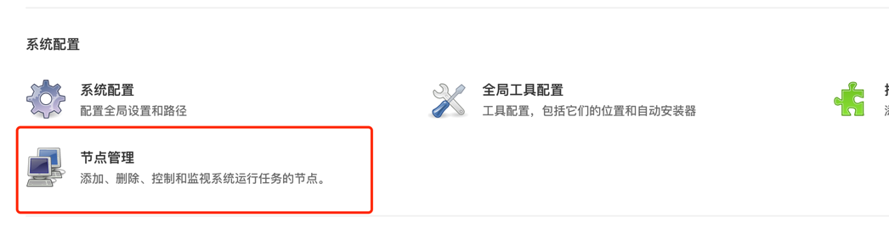
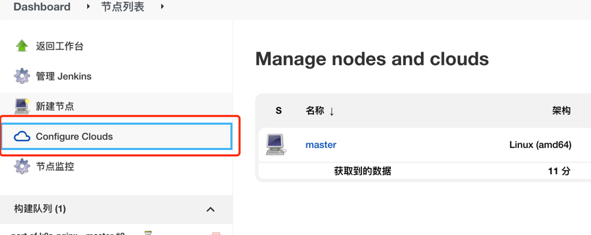
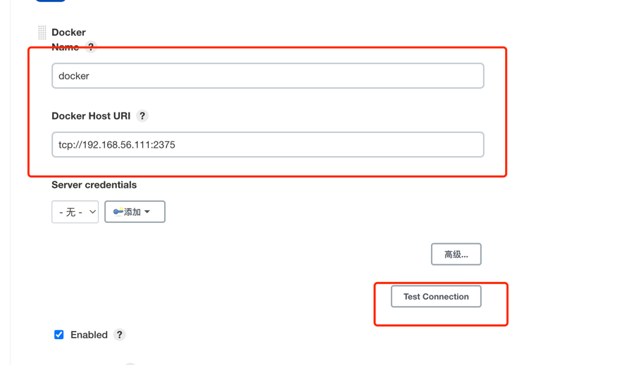
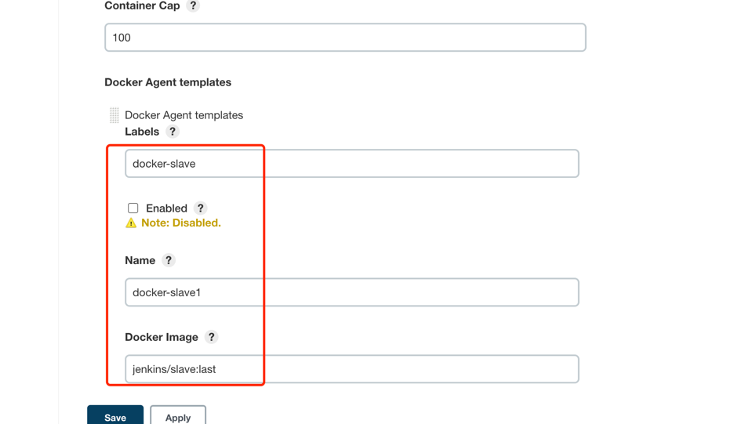

### 宿主docker配置

- 下载 docker 插件
- 添加docker 云node节点
- 添加 host
    - unix:/var/run/docker.sock
    - 指向本地
- unix:/var/run/docker.sock 映射到主机

### 远程docker

- 配置 docker 远程(192.168.56.120)tcp链接
    - 修改这个文件 /usr/lib/systemd/system/docker.service中的
    - ExecStart=/usr/bin/dockerd -H tcp://0.0.0.0:2375 -H fd:// --containerd=/run/containerd/containerd.sock
- 重启docker
- 添加 host
    - tcp://192.168.56.120:2375

### 配置 label

- docker-slave
- Docker-image
    - jenkins/slave:last
  

