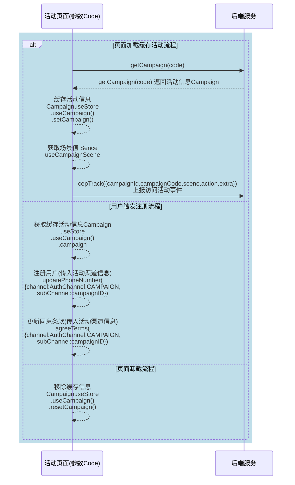

```mermaid

sequenceDiagram
participant Wechat as 活动页面(参数Code)
participant shared as  后端服务 
rect rgb(191, 222, 233)


alt 页面加载缓存活动流程
Wechat ->> shared: getCampaign(code) 
shared -->> Wechat: getCampaign(code) 返回活动信息Campaign
Wechat -->> Wechat: 缓存活动信息<br/>CampaignuseStore<br/>.useCampaign()<br/>.setCampaign()
Wechat -->> Wechat: 获取场景值 Sence<br/>useCampaignScene 
Wechat ->> shared: cepTrack({campaignId,campaignCode,scene,action,extra})<br/>上报访问活动事件
else 用户触发注册流程
Wechat -->> Wechat: 获取缓存活动信息Campaign<br/>useStore<br/>.useCampaign()<br/>.campaign
Wechat -->> Wechat: 注册用户(传入活动渠道信息) <br/>updatePhoneNumber(<br/>{channel:AuthChannel.CAMPAIGN,<br/>subChannel:campaignID})
Wechat -->> Wechat: 更新同意条款(传入活动渠道信息) <br/>agreeTerms(<br/>{channel:AuthChannel.CAMPAIGN,<br/>subChannel:campaignID})


else 页面卸载流程
Wechat -->> Wechat: 移除缓存信息<br/>CampaignuseStore<br/>.useCampaign()<br/>.resetCampaign()
end


end
```
