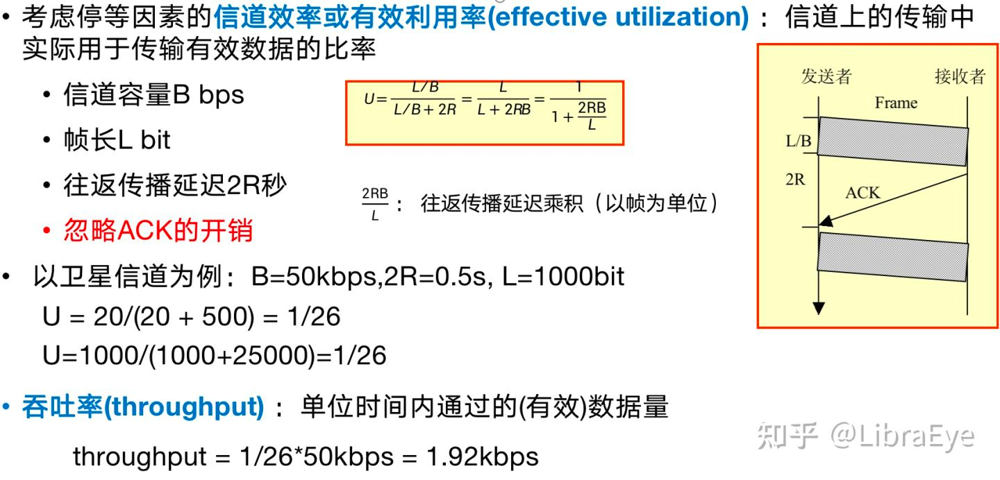
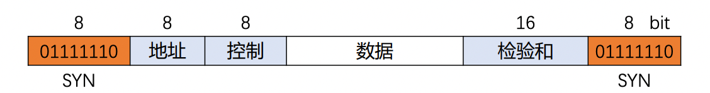

### 基础概念

1. 信道容量
    - 信道的最大数据传输速率
    - 信道内部最大的数据
    - 单位 bqs(比特率)
2. 宽带
    - 频带宽度（最高频率与最低频率的差）
    - 频率(1s 内完成周期性变化的次数)
    - 10Mb/s 带宽(通信线路中 1s 内最高可传输 10M 比特的数据量)
3. 速率
    - 数据传输速率(单位时间内传输的数据量)
    - 通信线路的最大数据传输速率(用来描述线路的数据传输能力)
4. 频率
    - 赫兹(Hz)
    - 1秒内交流电的变化次数

#### 数据链路层

1. 停等协议
    - 发送方：每发送一个数据帧,就会进入等待 ack 状态，接受到 ack 则发送下一个数据帧，延时或者错误则重发
    - 接收方：每接受到一个数据帧，都会响应一个 ack
        - 接收方如何确定哪一帧(通过 SEQ 字段确定当前帧和下一帧的序号)
    - 计算发送一个数据帧的实际吞吐率(比特率)
        - 信道容量(最大数据传送速率) 50K bqs
        - 帧长 1000bit
        - 往返延时 0.5 s
          

```
一个数据帧发送需要的时间
t1 = 1Kb/50Kbqs
实际用总时间
t = t1 + 0.5s
一个数据帧的实际吞吐率
1kb / t

```

2. GBN协议
    - 发送方：不断发送数据帧，就会进入等待 ack 状态，并记录下来
    - 接收方：接收到数据帧后，返回 ack-0，ack-2，作为标记

3. 帧的区分
   
    - 将 SYN(0x7D)[01111110]作为边界，表示帧的开始和结束。数据部分含有(0x7D)会转为(0x7E)
    - 地址字段固定字节
    - 控制字段固定字节
    - 协议
        - 0x0021——信息字段是IP数据报
    - 数据
        - 不超过 1500 字节

4. 点到点 PPP 协议


